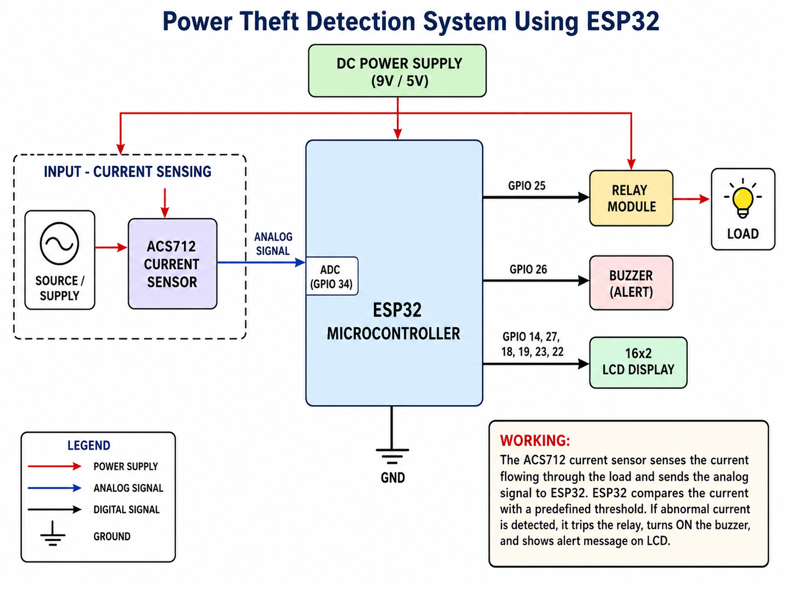
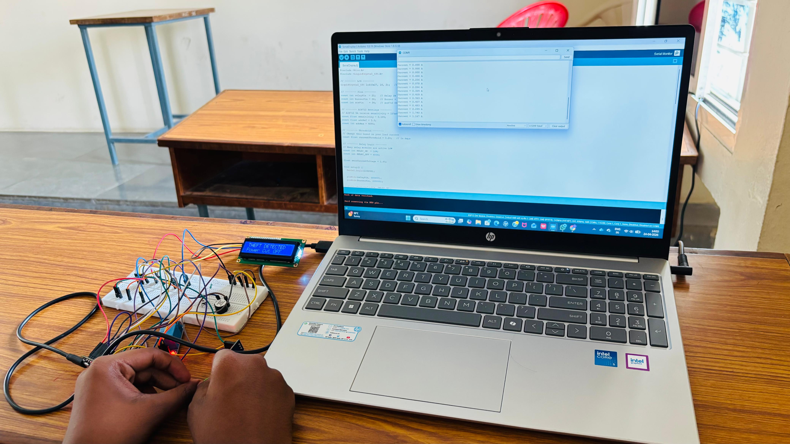

# Power Theft Detection System using ESP32

## Project Overview

The **Power Theft Detection System using ESP32** is an embedded systems project designed to detect abnormal current usage and prevent unauthorized electricity consumption.

In this project, an **ACS712 current sensor** is used to measure the current flowing through the load. The **ESP32 microcontroller** reads the current value and compares it with a predefined threshold. If abnormal current usage is detected, the system automatically turns OFF the relay, activates the buzzer, and displays an alert message on the LCD.

This project is developed as a **DC prototype** for academic demonstration purposes.

---

## Problem Statement

Power theft is one of the major problems in electrical distribution systems. Unauthorized electricity usage can cause revenue loss, overloading, power imbalance, and safety issues.

Traditional power theft detection methods mostly depend on manual inspection, which takes time and manpower. This project provides a simple prototype that can detect abnormal current consumption and take automatic action by disconnecting the load using a relay.

---

## Objectives

- To detect abnormal current consumption using the ACS712 current sensor.
- To use ESP32 as the main controller.
- To compare measured current with a predefined threshold value.
- To disconnect the load automatically using a relay.
- To alert the user using a buzzer.
- To display normal and theft conditions on a 16x2 LCD.
- To demonstrate an embedded system-based solution for power theft detection.

---

## Components Used

| Component | Purpose |
|---|---|
| ESP32 DevKit | Main microcontroller used for processing sensor values |
| ACS712 Current Sensor | Measures current flowing through the load |
| Relay Module | Disconnects the load during abnormal condition |
| Buzzer | Gives alert when theft is detected |
| 16x2 LCD Display | Displays system status |
| 9V Battery / DC Supply | Power supply for prototype |
| Jumper Wires | Used for circuit connections |
| Load | Used for testing current flow |

---

## Block Diagram



The block diagram shows the working flow of the Power Theft Detection System. The ACS712 current sensor measures the load current and sends an analog signal to the ESP32. Based on the threshold value, the ESP32 controls the relay, buzzer, and LCD display.

Basic system flow:

```text
DC Power Supply
       |
       v
ACS712 Current Sensor
       |
       v
ESP32 Microcontroller
   |        |        |
   v        v        v
 Relay    Buzzer    LCD Display
   |
   v
 Load
```
## Hardware Output Demo

The image below shows the working prototype with ESP32, ACS712 current sensor, relay module, buzzer, LCD display, and Arduino IDE serial monitor output.

